# Cineverse Ultimate 🎬

> **The Ultimate Movie Booking Experience**

**Cineverse Ultimate** is a premium, full-stack movie ticket booking application built with **Java Spring Boot**, **Thymeleaf**, and **MySQL**.

Features **real-time seat selection**, a comprehensive **admin dashboard**, and **wallet integration**. Designed with a modern Glassmorphism UI and secure role-based access control for a seamless user experience.

## ✨ Key Features

*   **Interactive Seat Booking**: Visual seat map with real-time selection updates (Premium, Gold, Silver classes).
*   **Smart Location**: Intelligent location detection that remembers user preference.
*   **Dynamic Pricing**: Prices adjust automatically based on showtime, day, and seat category.
*   **Admin Dashboard**: comprehensive analytics, movie management, and theater scheduling.
*   **Responsive Design**: A fully responsive, modern dark-themed interface built with vanilla CSS.

## 📸 Feature Showcase

> **Note**: Images are stored in the `screenshots` folder.

### 🎭 User Experience
**Home Page Gallery**
<p align="center">
  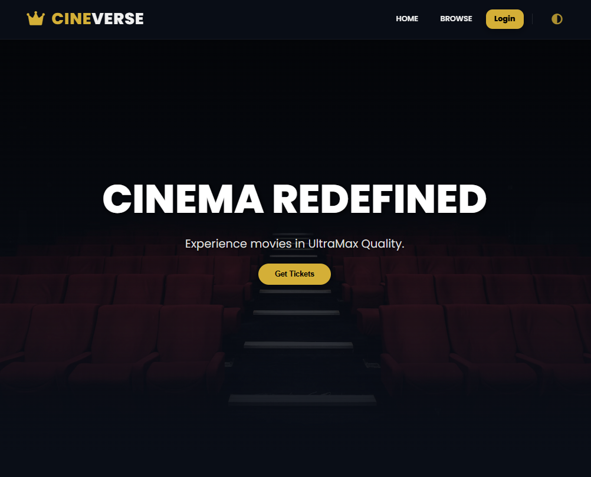
  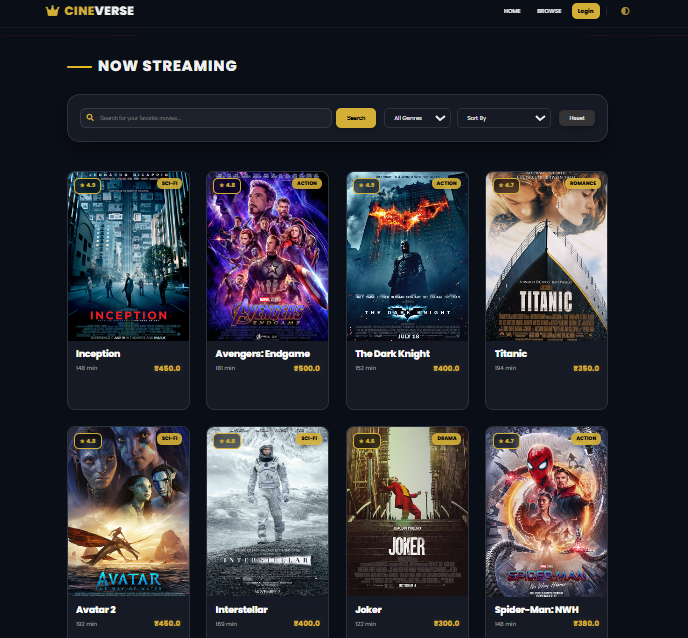
  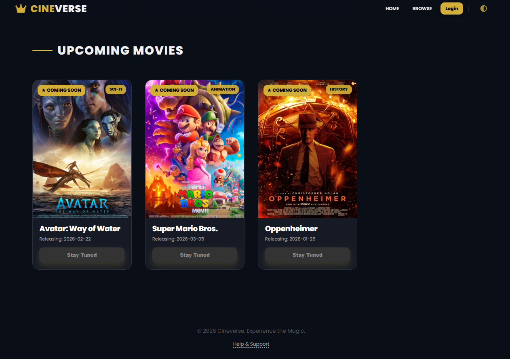
</p>

**Movie Details**
<p align="center">
  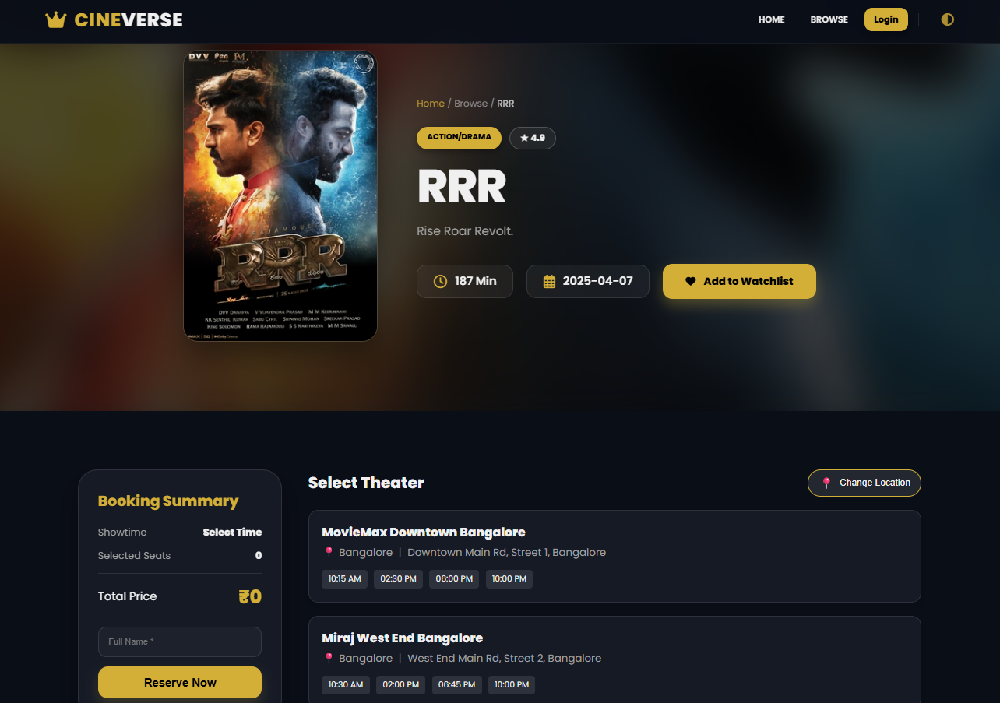
  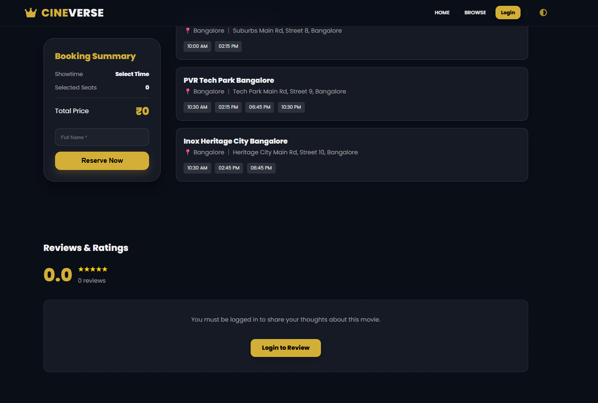
</p>

### 🎟️ Booking & Features
<p align="center">
  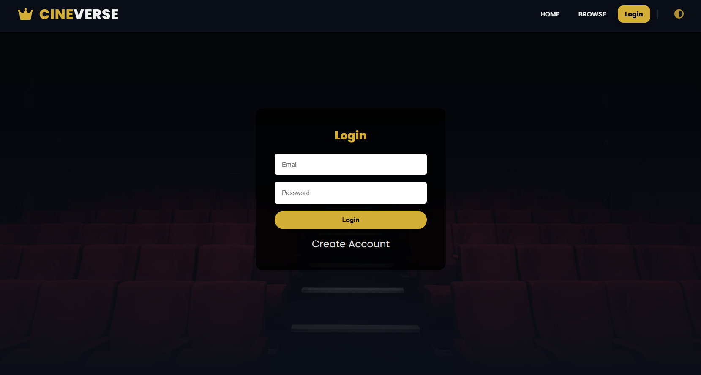
  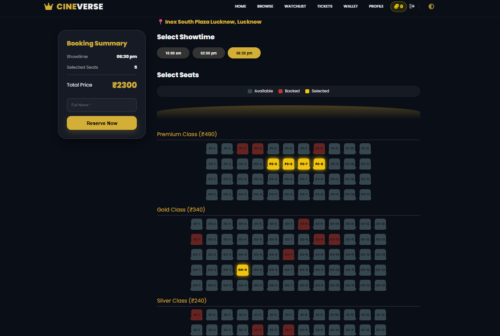
</p>
<p align="center">
  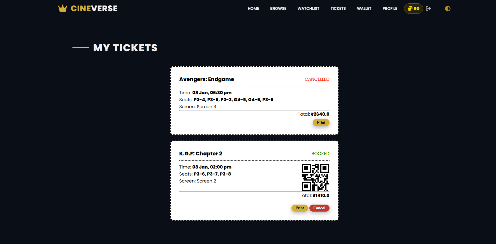
  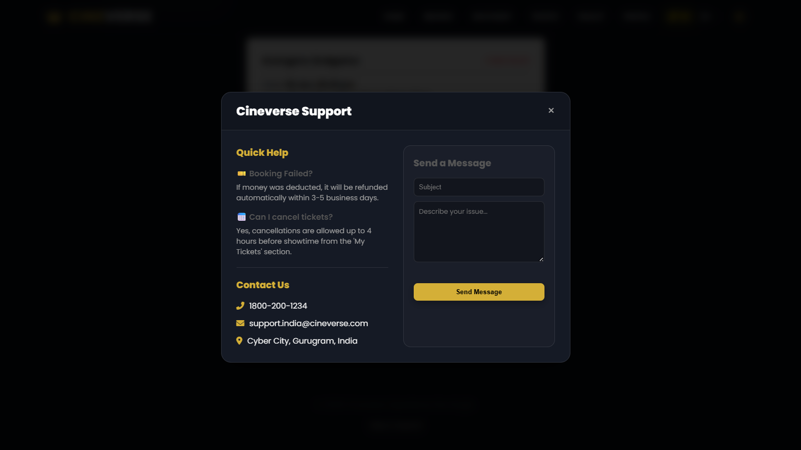
</p>

### ⚙️ Admin Portal
<p align="center">
  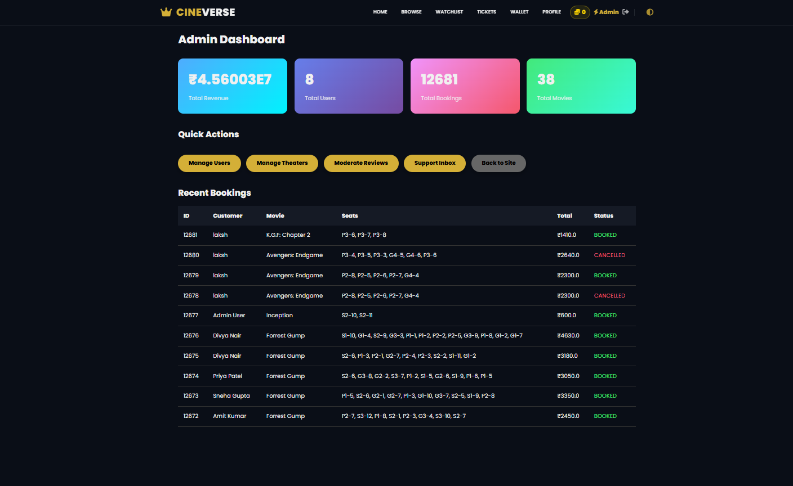
  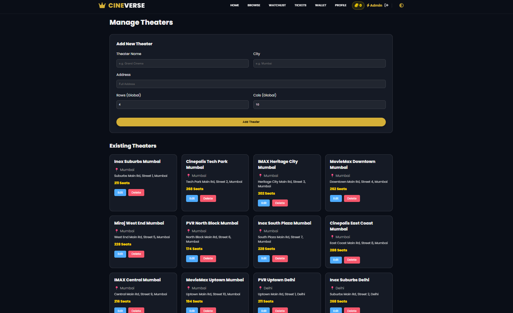
</p>

## 🛠️ Technology Stack

*   **Backend**: Java 17, Spring Boot 3.2 (Web, JPA, Security implementation without Spring Security dependency).
*   **Database**: MySQL 8.0 (Persistent storage).
*   **Frontend**: Thymeleaf, HTML5, CSS3, Vanilla JavaScript.
*   **Build Tool**: Maven.

## 🚀 Quick Start

1.  **Configure Database**: Create a MySQL database named `cineverse_db`.
2.  **Run Application**:
    ```bash
    mvn clean package
    java -jar target/cineverse-ultimate-0.0.1-SNAPSHOT.jar
    ```
3.  **Access**: Open `http://localhost:8081`.

## 👤 Credentials

| Role | Email | Password |
| :--- | :--- | :--- |
| **Admin** | `admin@cineverse.com` | `admin123` |
| **User** | `lakshmi@example.com` | `lakshmi123` |

## 🤝 Contact

Developed by **Lakshmi**.
